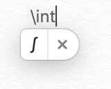
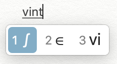

# macOS LaTeX Shortcuts

This script generates macOS text substitutions to allow for LaTeX-like unicode symbol shortcuts using macOS' native autocorrections. Note that due to the nature of unicode, the symbols may or may not be the same on other os or platforms.

## Installation

- Download `Text Substitutions.plist` from [releases](https://github.com/amadeus-lab/macos-latex-shortcuts/releases);
- Alternatively, execute `python create_plist.py` to generate `Text Substitutions.plist`;
- In `System Preferences | Keyboard | Text`, drag `Text Substitutions.plist` onto the left table.

## Symbols

The script contains most of the symbols listed [here](https://artofproblemsolving.com/wiki/index.php/LaTeX:Symbols). Additionally, it also contains macOS functional symbols including ``, `⌘`, `⌃`, `⌥`, `⇧`, `⇪`, `⇥`, `⏏`, `↩`, `⌫`, `⎋` and `␣`. For the full list of symbols, please refer to [shortcuts.py](shortcuts.py).

## Usages

There are two ways to invoke the shortcuts: 
- in English or any languages that does not use an seperate input source, use `\` with the command to trigger the shortcut. e.g. type `\infty` and then press space to get the `∞` symbol;

  
- in Chinese or any languages that use an seperate input source, use `v` with the command to trigger the shortcut. e.g. type `vinfty` in Chinese input source to get the `∞` symbol. This is due to the fact that typing `\` cannot trigger input source prompt.

  

Note that the autocorrection also automatically insert a space after the correction, so you may need remove the space in some cases.

The autocorrection ignore cases, so please use `big` in front of the command to get the symbols that starts with a capital letter in LaTeX. e.g. type `\bigomega` in English mode to get `\Omega` (`Ω`), or type `\bigrightarrow` to get `\Rightarrow` (`⇒`).

To get `\mathbb` or `\mathcal` symbols, use the environment name + character as the command. e.g. type `\vbbz` to get `\mathbb{Z}` (`ℤ`) and type `\call` to get `\mathcal{L}` (`ℒ`). Note that as in vanilla LaTeX, these environment only support a subset of characters, and please refer to [shortcuts.py](shortcuts.py) to get the full list of supported symbols.

To get combining symbols like `x̄` or `ŵ`, please add the combing symbol **after** typing the characters that you want to combine with. e.g. Type `\omega \bar \hat` to get `ω̄̂`. You need to manually remove the spaces so that the bar and the hat combine with the `ω` instead of the space. Due to the limitation of unicode, long combining symbols like `\widehat` or `\underbar` is not supported.
